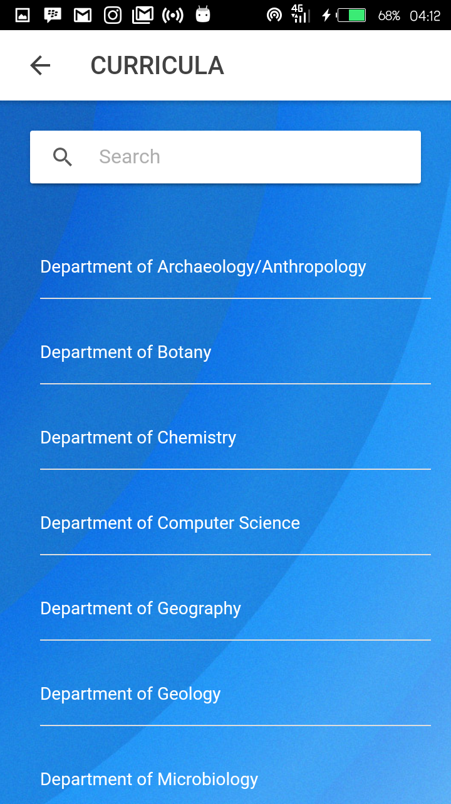
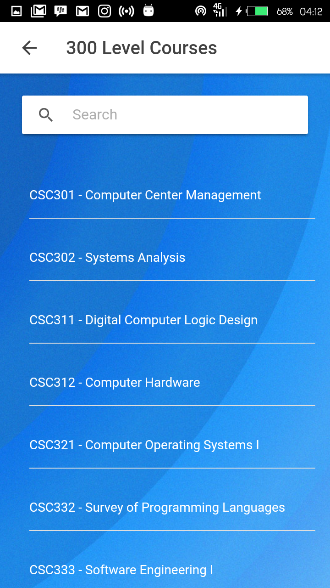
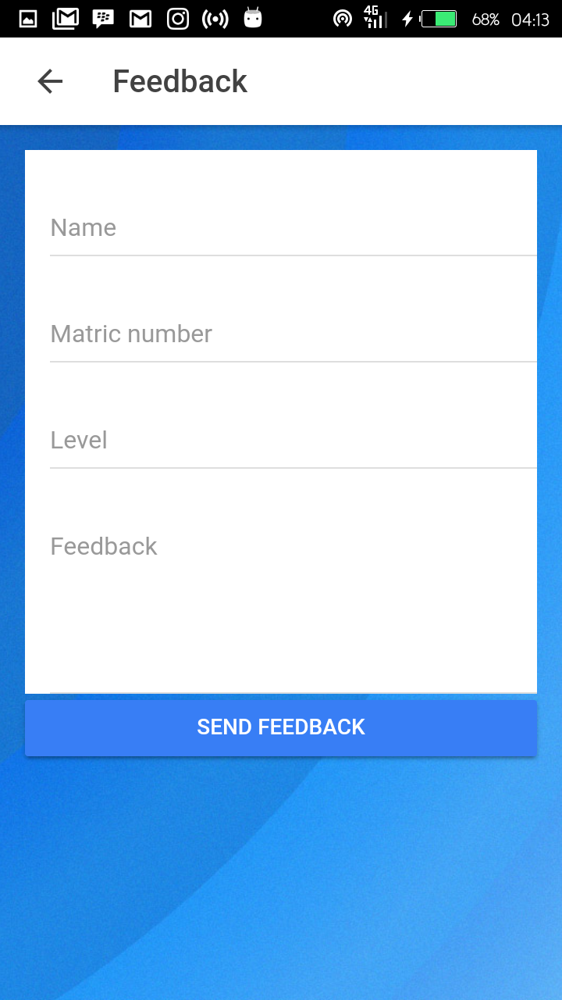

# CURRICULA
University of Ibadan, the oldest and the most prestigious Nigerian university, located five miles from the centre of the major city of Ibadan, Oyo State, was founded in 1948 and formerly known as University College Ibadan while its motto is ```Recte Sapere Fons```. The institution had three founding Faculties - Arts, Science, and Medicine, but today, there are 13 Faculties.

CURRICULA is a user-based monitoring app built with [Ionic 2](http://ionicframework.com) used to track the course outline and improve class interaction by updating an after-class feedback on each course that was treated. ```Only the department of Computer Science has been implemented.```

# USAGE
``` shell 
 git clone https://github.com/othreecodes/CURRICULA.git
```
After downloading/cloning it
Change directory and run npm install
Run
``` shell
cd CURRICULA
npm install # or yarn install 😉
```
and Finally

```shell
ionic serve
```
# SCREENSHOTS
- [Select Department](https://github.com/othreecodes/CURRICULA/tree/master/src/pages/department)

  
  
 - [Level Courses](https://github.com/othreecodes/CURRICULA/tree/master/src/pages/course-outline)

  
  
- [Give Feedback](https://github.com/othreecodes/CURRICULA/tree/master/src/pages/feedback)

  
  
# CONTRIBUTING
Submit a [PR](https://github.com/othreecodes/CURRICULA/pull/new/master) for any feature you'll like to add

# LISCENCE
MIT
  
  
  
  
